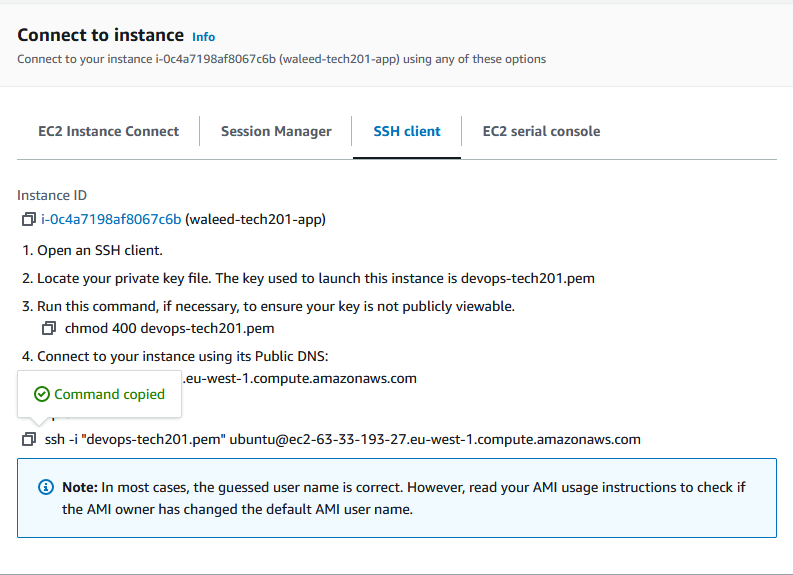
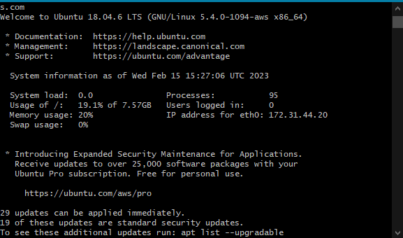
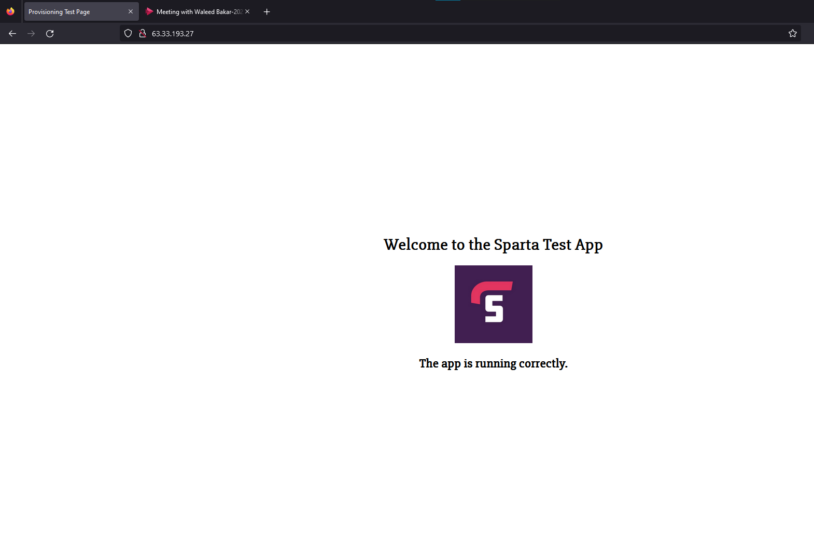

#  how to make an ec2 instance 
## Steps:
 1- Sign in to your AWS account. If you don't already have an account, you'll need to create one.

2- Once you're signed in, navigate to the EC2 dashboard. You can do this by selecting "EC2" under the "Compute" section in the AWS Management Console.

3 - Click the "Launch Instance" button to start the process of creating a new instance.

4 -Select an Amazon Machine Image (AMI) for your instance. An AMI is a pre-configured virtual machine image that contains the necessary information to launch an instance.

5 -Choose an Instance Type. This determines the hardware resources that will be allocated to your instance. Select an instance type based on the requirements of your application.

6- Configure the Instance. This step involves specifying the details of your instance, such as the number of instances you want to launch, the network settings, and storage options.

7-Configure Security Group. A security group acts as a virtual firewall that controls the traffic to and from your instance. You can create a new security group or select an existing one.

8-Review your Instance details. Make sure that all the details are correct before you launch the instance.

9-Launch the Instance. Once you've reviewed the details, click "Launch" to launch the instance.

10- Create a key pair. A key pair is used to securely SSH into your instance. You can create a new key pair or use an existing one.

11- Access your instance. Once your instance is running, you can access it by SSHing into it using the key pair you created earlier.

12- To do this go to the connection page and follow the steps on screen:

- Once you have done that you should see the following. 

# Migrating files to AWS

Migrating files to aws can do done by doing the following.
We can use the SCP command

`scp -i devops-tech201.pem -r C:\Users\James_Cole\.vscode\tech201_virtualisation\tech201_virtualisation\app ubuntu@ec2-34-248-205-55.eu-west-1.compute.amazonaws.com:/home/ubuntu`

This line has to be written in the .ssh folder on your pc to connect to the remote host.

after this we must connect to our AWS and navigate to the app file such as `ubuntu@ip-172-31-21-5:~/app$.`

Then run the following:

`sudo apt install npm`

`node app.js`

# Running the app and setting up the reverse proxy

Navigate to your IP address in EC2 Instance connect from the AWS website. by going to the :3000 port your app should now be working however, It will not work by reverse proxy unless it has been configured this way.

# How to a working reverse proxy

    First, access your VM by typing in terminal the vagrant up(to get it running) and vagrant ssh(to get inside the VM) commands.
    Now, within your VM, run the command sudo nano /etc/nginx/sites-available/default. This will open up the default configuration file for NGINX and allow you to make the necessary changes. This file should look like this:

you then want to add the following `server {
        listen 80 default_server;
        listen [::]:80 default_server;

        root /var/www/html;

        index index.html index.htm index.nginx-debian.html;

        server_name _;

        location / {
                proxy_pass http://localhost:3000;
        }

}

this Will allow the app to work without port 3000 like so:
